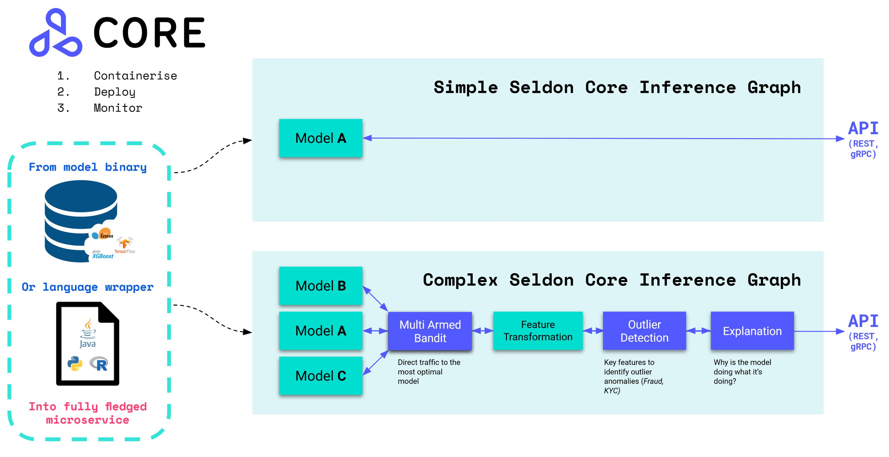

Seldon - an open source platform to deploy your machine learning models on Kubernetes at massive scale.

Concept:

<code>
<b>Seldon core converts your ML models (Tensorflow, Pytorch, H2o, etc.) or language wrappers (Python, Java, etc.) into production REST/GRPC microservices.</b> 
</code>
