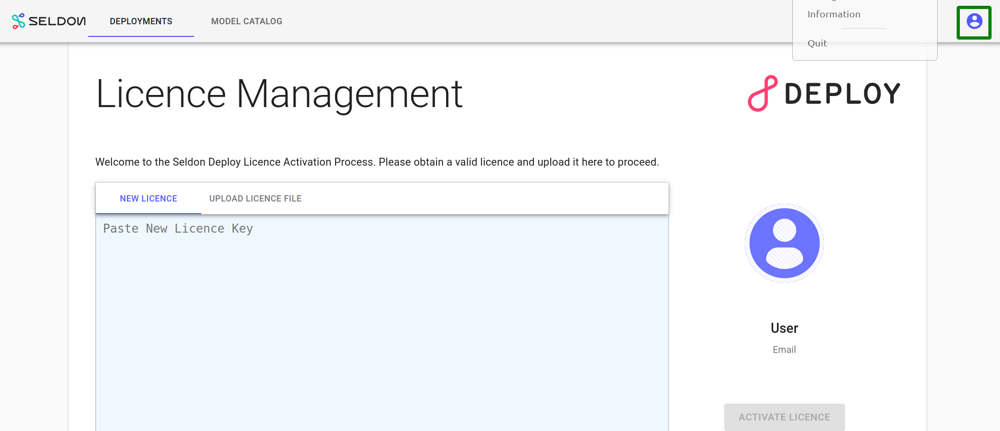

Installtion seldon-core


Required components

    1. Istio
    2. seldon core
    3. seldon deploy

Istio installtion process

```bash

export ISTIO_VERSION=1.7.3
curl -L https://istio.io/downloadIstio | ISTIO_VERSION=${ISTIO_VERSION} sh -
cd istio-${ISTIO_VERSION}
export PATH="$PATH:$PWD/bin"

```

Istio Opearator installation process

```bash

 istioctl operator init
 kubectl get all -n istio-operator

```

Uninstall the control-plane (If Required)

```bash
istioctl operator remove
```


Istio control-plane installation

```bash

kubectl create ns istio-system
istioctl profile list

```

```yml
# vim istio-control-plane.yml
apiVersion: install.istio.io/v1alpha1
kind: IstioOperator
metadata:
  namespace: istio-system
  name: istio-control-plane
spec:
  profile: demo
  
```

```bash

vim istio-control-plane.yml
kubectl apply -f istio-control-plane.yml

```

uninstall istio-control-plane (If Required)

```bash

kubectl delete -f istio-control-plane.yml
or
kubectl delete iop -n istio-system istio-control-plane

```


seldon core installation

```bash

helm repo add seldonio https://storage.googleapis.com/seldon-charts
helm repo update

```

seldon-core-values yml preparation

```yml

# vim seldon-core-values.yml
# helm get values -a seldon-core
ambassador:
  enabled: false   # Modified
  singleNamespace: false
certManager:
  enabled: false
controllerId: ""
crd:
  create: true
  forceV1: false
  forceV1beta1: false
credentials:
  gcs:
    gcsCredentialFileName: gcloud-application-credentials.json
  s3:
    s3AccessKeyIDName: awsAccessKeyID
    s3SecretAccessKeyName: awsSecretAccessKey
defaultUserID: "8888"
engine:
  grpc:
    port: 5001
  image:
    pullPolicy: IfNotPresent
    registry: docker.io
    repository: seldonio/engine
    tag: 1.9.1
  logMessagesExternally: false
  port: 8000
  prometheus:
    path: /prometheus
  resources:
    cpuLimit: 500m
    cpuRequest: 500m
    memoryLimit: 512Mi
    memoryRequest: 512Mi
  serviceAccount:
    name: default
  user: 8888
executor:
  image:
    pullPolicy: IfNotPresent
    registry: docker.io
    repository: seldonio/seldon-core-executor
    tag: 1.9.1
  metricsPortName: metrics
  port: 8000
  prometheus:
    path: /prometheus
  requestLogger:
    defaultEndpoint: http://default-broker
  resources:
    cpuLimit: 500m
    cpuRequest: 500m
    memoryLimit: 512Mi
    memoryRequest: 512Mi
  serviceAccount:
    name: default
  user: 8888
explainer:
  image: seldonio/alibiexplainer:1.9.1
image:
  pullPolicy: IfNotPresent
  registry: docker.io
  repository: seldonio/seldon-core-operator
  tag: 1.9.1
istio:
  enabled: false
  gateway: istio-system/seldon-gateway
  tlsMode: ""
keda:
  enabled: false
kubeflow: false
manager:
  cpuLimit: 500m
  cpuRequest: 100m
  logLevel: INFO
  memoryLimit: 300Mi
  memoryRequest: 200Mi
managerCreateResources: false
managerUserID: 8888
namespaceOverride: ""
predictiveUnit:
  defaultEnvSecretRefName: ""
  grpcPort: 9500
  httpPort: 9000
  metricsPortName: metrics
predictor_servers:
  MLFLOW_SERVER:
    protocols:
      seldon:
        defaultImageVersion: 1.9.1
        image: seldonio/mlflowserver
  SKLEARN_SERVER:
    protocols:
      kfserving:
        defaultImageVersion: 0.3.2
        image: seldonio/mlserver
      seldon:
        defaultImageVersion: 1.9.1
        image: seldonio/sklearnserver
  TEMPO_SERVER:
    protocols:
      kfserving:
        defaultImageVersion: 0.3.2
        image: seldonio/mlserver
  TENSORFLOW_SERVER:
    protocols:
      seldon:
        defaultImageVersion: 1.9.1
        image: seldonio/tfserving-proxy
      tensorflow:
        defaultImageVersion: 2.1.0
        image: tensorflow/serving
  TRITON_SERVER:
    protocols:
      kfserving:
        defaultImageVersion: 20.08-py3
        image: nvcr.io/nvidia/tritonserver
  XGBOOST_SERVER:
    protocols:
      kfserving:
        defaultImageVersion: 0.3.2
        image: seldonio/mlserver
      seldon:
        defaultImageVersion: 1.9.1
        image: seldonio/xgboostserver
rbac:
  configmap:
    create: true
  create: true
serviceAccount:
  create: true
  name: seldon-manager
singleNamespace: false
storageInitializer:
  cpuLimit: "1"
  cpuRequest: 100m
  image: seldonio/rclone-storage-initializer:1.9.1
  memoryLimit: 1Gi
  memoryRequest: 100Mi
usageMetrics:
  enabled: true  # modified
webhook:
  port: 4443

```


```bash

kubectl create ns seldon-system
helm upgrade seldon-core seldonio/seldon-core-operator --version 1.9.1 -f seldon-core-values.yml --namespace seldon-system --install

```

seldon deploy configuration

```bash
TAG=1.3.0 && \
    docker create --name=tmp-sd-container seldonio/seldon-deploy-server:$TAG && \
    docker cp tmp-sd-container:/seldon-deploy-dist/seldon-deploy-install.tar.gz . && \
    docker rm -v tmp-sd-container

tar -xzf seldon-deploy-install.tar.gz

kubectl create ns seldon-logs
helm upgrade seldon-deploy ./seldon-deploy-install/sd-setup/helm-charts/seldon-deploy/ \
    --set image.image=seldonio/seldon-deploy-server:1.3.0 \
    --set virtualService.create=false \
    --set requestLogger.create=false \
    --set gitops.argocd.enabled=false \
    --set elasticsearch.basicAuth=false \
    --set enableAppAuth=false \
    --namespace=seldon-system \
    --install

```
seldon deploy output

```bash

export POD_NAME=$(kubectl get pods --namespace seldon-system -l "app.kubernetes.io/name=seldon-deploy,app.kubernetes.io/instance=seldon-deploy" -o jsonpath="{.items[0].metadata.name}")
echo "Visit http://127.0.0.1:8000/seldon-deploy/ to use your application"
kubectl port-forward $POD_NAME 8000:8000 --namespace seldon-system

```

seldon deploy connect via istio

```yml
---
apiVersion: networking.istio.io/v1beta1
kind: VirtualService
metadata:
  name: seldon-deploy
  namespace: seldon-system
spec:
  gateways:
  - seldon-gateway
  hosts:
  - '*'
  http:
  - match:
    - uri:
        prefix: /seldon-deploy/
    route:
    - destination:
        host: seldon-deploy
        port:
          number: 80
---
apiVersion: networking.istio.io/v1alpha3
kind: Gateway
metadata:
  name: seldon-gateway
  namespace: seldon-system
spec:
  selector:
    istio: ingressgateway # use istio default controller
  servers:
  - port:
      number: 80
      name: http
      protocol: HTTP
    hosts:
    - "*"

```
seldon-deploy UI output



